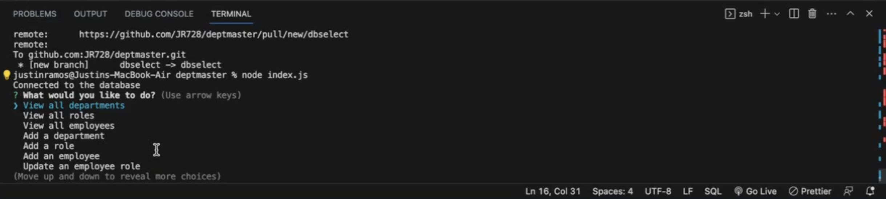
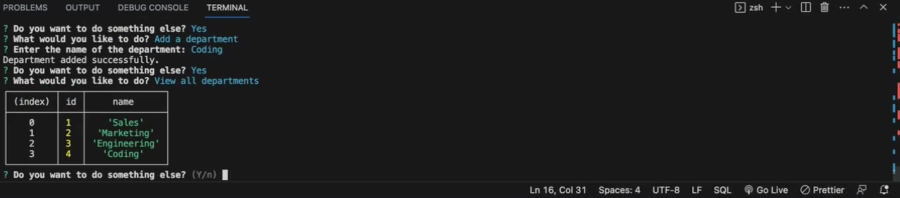

# deptmaster

## Description
This is a mysql program that keeps tracks of a business deparments roles and employees and has the ability to add all 3 and change an employees role. It uses a series of questions to navagtie and gives tables in a neat manner.

Walkthrough https://drive.google.com/file/d/1pXYgMGLUzsNijG22URjj95LmGXd29gwH/view
## Usage
use npm install and have a user and password to my sql to put in a dotenv file source the schema and seeds to get the place holders.
## Images

## Credits
Justin
## License
MIT